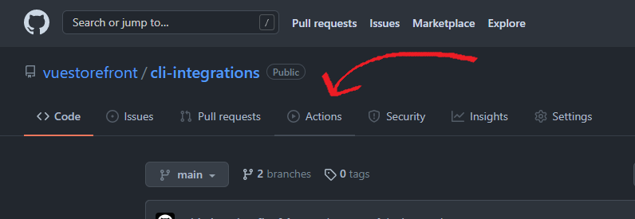
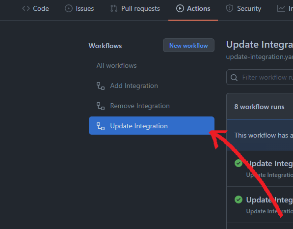
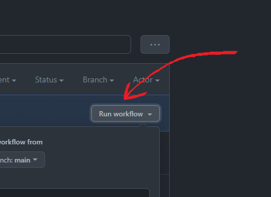
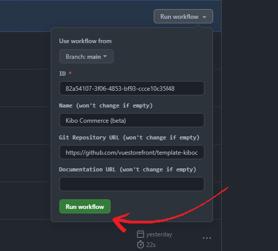

# `cli-integrations`

  ---------

### Stay connected

[](https://github.com/vuestorefront/vue-storefront)
[](https://twitter.com/vuestorefront)
[](https://www.youtube.com/c/VueStorefront)
[](https://discord.vuestorefront.io)

The list of `@vue-storefront/cli` integration options and some workflows (using GitHub Actions) to managem them.

## How to consume these integrations?

You can just fetch as any raw content in the GitHub.

```js
fetch('https://github.com/vuestorefront/cli-integrations/blob/main/data.json')
  .then((response) => response.json())
  .then((integrations) => {
    // ...
  });
```

## How to add, update or remove an integration?

To add, update or remove an integration you must have `write` permission in this repository. With `write` permission you can execute "Add Integration", "Update Integration" or "Remove Integration" manual workflows.

### How to execute a manual workflow?

1. Open repository "Actions".

   

2. Select the workflow you want to run.

   

3. Click in "Run workflow" button.

   

4. Fill in workflow's inputs and submit to execute the workflow.

   
